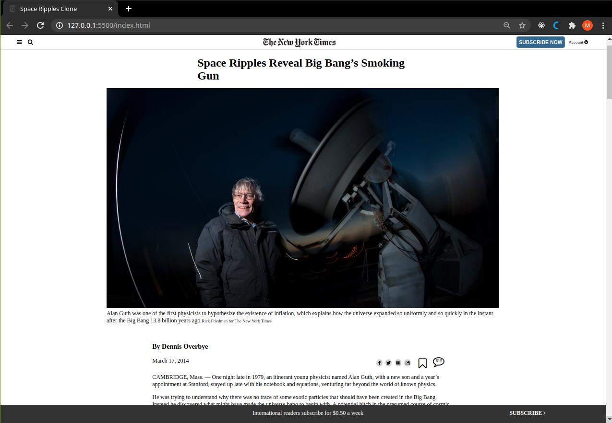

# New York Times Article Clone Page

> The objective of this project was to recreate a given page from the New York Times (https://www.nytimes.com/2014/03/18/science/space/detection-of-waves-in-space-buttresses-landmark-theory-of-big-bang.html?_r=0&auth=login-google)

The whole project was created using CSS positioning, FLEX, Grid and floating of some elements.

## Built With

- HTML, CSS.
- No frameworks,
- Flex, Grid, Float

## Live Demo

[Live Demo Link](https://raw.githack.com/mateomh/newyork_times_clone/times_clone_page/index.html)

## Authors

👤 **Mateo mojica**

- Github: [@mateomh](https://github.com/mateomh)
- Twitter: [@mateo_m_h](https://twitter.com/mateo_m_h)
- Linkedin: [linkedin](https://linkedin.com/mateo_mojica_hernandez)

👤 **Youcef ABDELLANI**

- Github: [@ABDELLANI-Youcef](https://github.com/ABDELLANI-Youcef)
- Twitter: [@YoucefAbdellani](https://twitter.com/YoucefAbdellani)
- Linkedin: [linkedin](https://www.linkedin.com/in/youcef-abdellani-b79361124/)

## 🤝 Contributing

Contributions, issues and feature requests are welcome!

Feel free to check the [issues page](issues/).

## Show your support

Give a ⭐️ if you like this project!

## Acknowledgments

- New York Times, article "Space Ripples Reveal Big Bang’s Smoking Gun"
- CSS Tricks page
- Odin Project

## 📝 License

This project is [MIT](lic.url) licensed.